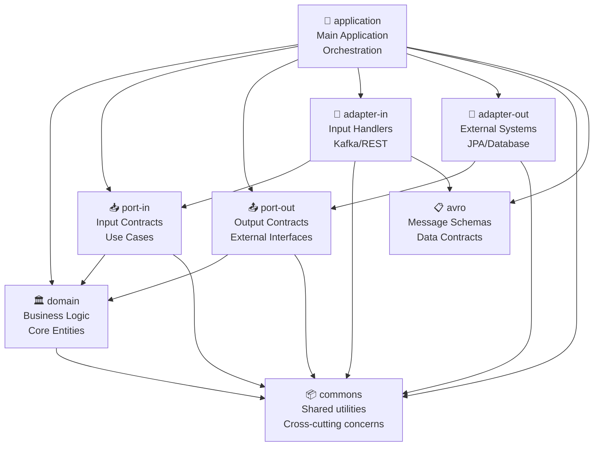

# Enterprise Action Items Management System

## 🎯 Overview
A robust, scalable, and maintainable system for managing action items (tasks) in an enterprise environment. Built with clean architecture principles, this system demonstrates production-grade software engineering practices, including domain-driven design, hexagonal architecture, and event-driven processing.

## 🏗 Architecture

### Core Principles
- **Clean Architecture**: Strict separation of concerns with dependencies pointing inward
- **Domain-Driven Design**: Rich domain model with encapsulated business logic
- **Hexagonal Architecture**: Ports and adapters pattern for infrastructure isolation
- **Event-Driven**: Asynchronous processing with Kafka for scalability
- **SOLID Principles**: Interface segregation, dependency inversion, and single responsibility

### Module Dependency Diagram



The diagram above illustrates the modular architecture and dependency relationships:

- **🔵 Core Modules** (Blue): Foundation layer containing business logic and contracts
- **🟣 Adapter Modules** (Purple): Interface layer handling external system interactions
- **🟢 Application Module** (Green): Orchestration layer coordinating all components
- **🟠 Schema Module** (Orange): Data contract definitions
- **⚪ External Systems** (Gray, dashed): External dependencies and services

**Key Architectural Principles Demonstrated:**
- **Dependency Inversion**: Core domain has no external dependencies
- **Clean Architecture**: Dependencies point inward toward the domain
- **Separation of Concerns**: Each module has a single, well-defined responsibility
- **Interface Segregation**: Ports define focused contracts

### Module Structure

#### 1. Domain Module (`domain/`)
The heart of the system, containing core business logic and rules.
- **Models**: Rich domain entities (e.g., `ActionItem`, `ProcessingError`)
- **Services**: Domain services implementing business rules
- **Value Objects**: Immutable business concepts
- **Enums**: Domain-specific enumerations (e.g., `ActionItemStatus`)

Key Features:
- Pure business logic, no infrastructure dependencies
- Rich validation and business rules
- Encapsulated domain invariants
- Ubiquitous language implementation

#### 2. Ports Layer
Defines the system's boundaries and contracts.

##### Port-In (`port-in/`)
Input ports defining use cases:
- `ReceiveActionItemUseCase`: Primary use case for processing action items
- `HandleProcessingErrorUseCase`: Error handling contract
- Command objects (e.g., `ProcessActionItemCommand`)

##### Port-Out (`port-out/`)
Output ports for external interactions:
- `SaveActionItemPort`: Persistence contract
- `PersistErrorPort`: Error persistence contract

#### 3. Application Layer (`application/`)
Orchestrates use cases and coordinates between layers.
- **Services**: Implements port-in contracts
  - `ActionItemService`: Main business flow orchestration
  - `ErrorHandlingService`: Error management
- **Configuration**: Spring Boot configuration
- Transaction management
- Cross-cutting concerns

#### 4. Adapters Layer
Implements the ports for specific technologies.

##### Adapter-In (`adapter-in/`)
Handles incoming requests:
- **Kafka Consumer**: Message processing
  - `ActionItemKafkaConsumer`: Message consumption
  - `ActionItemMessageProcessor`: Message processing
  - `ActionItemProcessingErrorHandler`: Error handling
- **REST Controllers**: HTTP endpoints
- **Mappers**: External to internal format conversion

##### Adapter-Out (`adapter-out/`)
Manages external system interactions:
- **Persistence**: JPA implementation
  - `ActionItemPersistenceAdapter`: Action item persistence
  - `JpaErrorPersistenceAdapter`: Error persistence
  - Entity mappings and repositories
- **Mappers**: Internal to external format conversion

#### 5. Supporting Modules
- **Commons**: Shared utilities and cross-cutting concerns
- **Avro**: Message schemas and data contracts

### 🔄 System Flow

#### Action Item Processing
1. **Message Reception**
   ```
   Kafka Message → ActionItemKafkaConsumer
   ```

2. **Message Processing**
   ```
   ActionItemAsyncRequest → ActionItemMessageProcessor
   → ProcessActionItemCommand → ReceiveActionItemUseCase
   ```

3. **Business Logic**
   ```
   ActionItemService → ActionItemDomainService
   → Validation & Enrichment → SaveActionItemPort
   ```

4. **Persistence**
   ```
   ActionItemPersistenceAdapter → JPA Entity
   → Database
   ```

#### Error Handling
1. **Error Detection**
   ```
   Exception → ActionItemProcessingErrorHandler
   ```

2. **Error Processing**
   ```
   HandleProcessingErrorUseCase → ErrorHandlingService
   → PersistErrorPort → JpaErrorPersistenceAdapter
   ```

## 🛠 Technical Stack

### Core Technologies
- **Java 17**: Modern Java features and performance
- **Spring Boot**: Application framework
- **Spring Kafka**: Message processing
- **Spring Data JPA**: Persistence
- **Apache Avro**: Message schemas
- **Maven**: Build and dependency management

### Key Features
- **Asynchronous Processing**: Non-blocking message handling
- **Transaction Management**: ACID compliance
- **Error Handling**: Comprehensive error tracking
- **Validation**: Multi-layer validation
- **Monitoring**: Built-in observability
- **Scalability**: Event-driven architecture

## 🚀 Getting Started

### Prerequisites
- Java 17 or higher
- Maven 3.8+
- Kafka cluster
- PostgreSQL database

### Building
```bash
mvn clean install
```

### Configuration
1. Database setup in `application.properties`
2. Kafka configuration
3. Error handling settings

### Running
```bash
mvn spring-boot:run
```

## 📚 Best Practices Implemented

### Architecture
- Clean Architecture principles
- Domain-Driven Design
- SOLID principles
- Interface segregation
- Dependency inversion

### Code Quality
- Comprehensive documentation
- Unit testing
- Integration testing
- Error handling
- Logging
- Monitoring

### Security
- Input validation
- Error message sanitization
- Transaction boundaries
- Secure configuration

### Performance
- Asynchronous processing
- Connection pooling
- Batch processing
- Efficient mapping

## 🔍 Monitoring and Maintenance

### Logging
- Structured logging
- Error tracking
- Performance metrics
- Audit trails

### Error Management
- Centralized error handling
- Error persistence
- Error categorization
- Recovery mechanisms

### Performance Monitoring
- Message processing metrics
- Database performance
- System health
- Resource utilization

## 🤝 Contributing
1. Fork the repository
2. Create a feature branch
3. Commit changes
4. Push to the branch
5. Create a Pull Request

## 📄 License
This project is licensed under the MIT License - see the LICENSE file for details.
