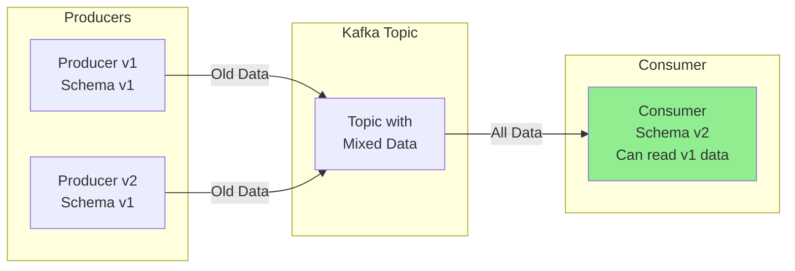
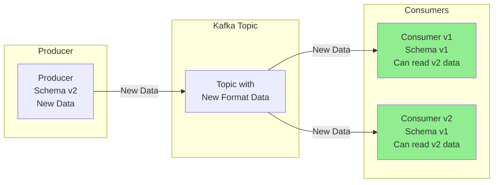
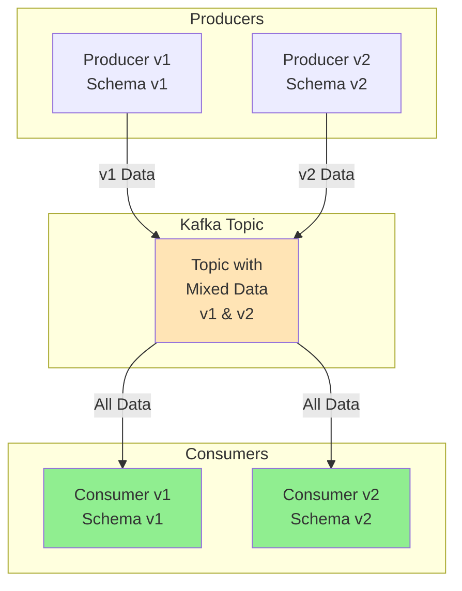
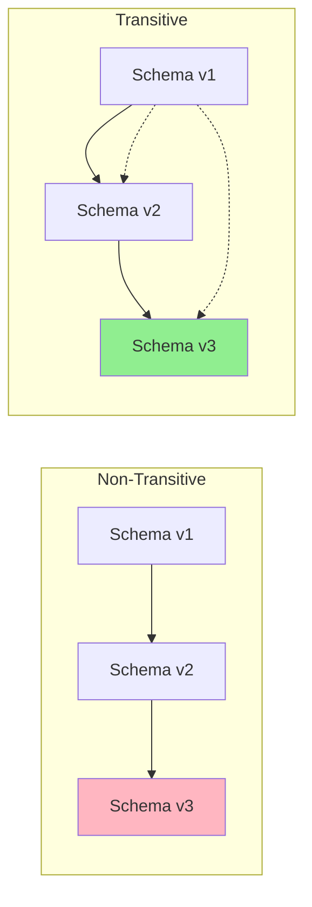

# 🔄 Kafka Schema Registry Evolution Guide

## 📋 Table of Contents
- [Overview](#overview)
- [What is Schema Evolution?](#what-is-schema-evolution)
- [Compatibility Types](#compatibility-types)
- [Backward Compatibility](#backward-compatibility)
- [Forward Compatibility](#forward-compatibility)
- [Full Compatibility](#full-compatibility)
- [No Compatibility](#no-compatibility)
- [Transitive Properties](#transitive-properties)
- [Client Upgrade Order](#client-upgrade-order)
- [Practical Examples](#practical-examples)
- [Best Practices](#best-practices)
- [Configuration Examples](#configuration-examples)
- [Common Pitfalls](#common-pitfalls)
- [Resources](#resources)

## 🎯 Overview

Schema evolution in Apache Kafka's Schema Registry allows you to modify your data schemas over time while maintaining compatibility between producers and consumers. This guide provides comprehensive insights into schema evolution strategies, compatibility types, and practical examples.

**Reference**: [Confluent Schema Registry Documentation](https://docs.confluent.io/platform/current/schema-registry/fundamentals/schema-evolution.html)

## 🔄 What is Schema Evolution?

Schema evolution is the process of changing a schema over time to accommodate new requirements while maintaining compatibility with existing data and applications. This is crucial in distributed systems where:

- Multiple versions of applications run simultaneously
- Rolling deployments are common
- Data must remain accessible across different schema versions
- Zero-downtime upgrades are required

## 🛡️ Compatibility Types

Schema Registry supports several compatibility modes that determine how schemas can evolve:

### 1. Backward Compatibility (`BACKWARD`)
New schema can read data written with the previous schema.

### 2. Forward Compatibility (`FORWARD`) 
Previous schema can read data written with the new schema.

### 3. Full Compatibility (`FULL`)
New schema is both backward and forward compatible.

### 4. No Compatibility (`NONE`)
Schema compatibility checks are disabled.

Each type also has a `_TRANSITIVE` variant that checks compatibility across all previous versions, not just the immediate predecessor.

## ⬅️ Backward Compatibility

### Concept
**Backward compatibility** ensures that consumers using the new schema can process data written by producers using the previous schema.

### Allowed Changes
- ✅ Add optional fields (with default values)
- ✅ Remove fields
- ✅ Change field order (in Avro)

### Forbidden Changes
- ❌ Add required fields without default values
- ❌ Change field types
- ❌ Rename fields

### Example: User Schema Evolution

**Version 1 (Original Schema)**
```json
{
  "type": "record",
  "name": "User",
  "fields": [
    {"name": "id", "type": "string"},
    {"name": "name", "type": "string"},
    {"name": "email", "type": "string"}
  ]
}
```

**Version 2 (Backward Compatible)**
```json
{
  "type": "record",
  "name": "User",
  "fields": [
    {"name": "id", "type": "string"},
    {"name": "name", "type": "string"},
    {"name": "email", "type": "string"},
    {"name": "phone", "type": ["null", "string"], "default": null},
    {"name": "created_at", "type": "long", "default": 0}
  ]
}
```

### Backward Compatibility Flow Diagram



## ➡️ Forward Compatibility

### Concept
**Forward compatibility** ensures that consumers using the previous schema can process data written by producers using the new schema.

### Allowed Changes
- ✅ Remove optional fields
- ✅ Add fields (consumers with old schema will ignore them)

### Forbidden Changes
- ❌ Add required fields
- ❌ Change field types
- ❌ Remove required fields

### Example: Product Schema Evolution

**Version 1 (Original Schema)**
```json
{
  "type": "record",
  "name": "Product",
  "fields": [
    {"name": "id", "type": "string"},
    {"name": "name", "type": "string"},
    {"name": "price", "type": "double"},
    {"name": "description", "type": ["null", "string"], "default": null}
  ]
}
```

**Version 2 (Forward Compatible)**
```json
{
  "type": "record",
  "name": "Product",
  "fields": [
    {"name": "id", "type": "string"},
    {"name": "name", "type": "string"},
    {"name": "price", "type": "double"}
  ]
}
```

### Forward Compatibility Flow Diagram



## 🔄 Full Compatibility

### Concept
**Full compatibility** combines both backward and forward compatibility, allowing maximum flexibility during deployments.

### Use Cases
- Rolling deployments
- Blue-green deployments
- Mixed version environments
- Gradual migrations

### Example: Order Schema Evolution

**Version 1**
```json
{
  "type": "record",
  "name": "Order",
  "fields": [
    {"name": "orderId", "type": "string"},
    {"name": "customerId", "type": "string"},
    {"name": "amount", "type": "double"},
    {"name": "currency", "type": "string", "default": "USD"}
  ]
}
```

**Version 2 (Full Compatible)**
```json
{
  "type": "record",
  "name": "Order",
  "fields": [
    {"name": "orderId", "type": "string"},
    {"name": "customerId", "type": "string"},
    {"name": "amount", "type": "double"},
    {"name": "currency", "type": "string", "default": "USD"},
    {"name": "discountCode", "type": ["null", "string"], "default": null}
  ]
}
```

### Full Compatibility Flow Diagram



## 🚫 No Compatibility

### When to Use
- Breaking changes are necessary
- Complete application upgrade
- New topic creation
- Development/testing environments

### Example: Breaking Change

**Version 1**
```json
{
  "type": "record",
  "name": "Event",
  "fields": [
    {"name": "timestamp", "type": "string"},
    {"name": "eventType", "type": "string"}
  ]
}
```

**Version 2 (Breaking Change)**
```json
{
  "type": "record",
  "name": "Event",
  "fields": [
    {"name": "timestamp", "type": "long"},
    {"name": "eventCategory", "type": "string"},
    {"name": "eventSubtype", "type": "string"}
  ]
}
```

## 🔗 Transitive Properties

### Non-Transitive (Default)
Compatibility is checked only against the immediate previous version.

### Transitive
Compatibility is checked against **all** previous versions.

### Comparison Diagram



## 📅 Client Upgrade Order

### Backward Compatibility
1. Upgrade **consumers** first
2. Then upgrade **producers**

### Forward Compatibility  
1. Upgrade **producers** first
2. Then upgrade **consumers**

### Full Compatibility
- Upgrade **producers and consumers** in any order

### Upgrade Strategy Diagram

```mermaid
gantt
    title Schema Evolution Upgrade Strategies
    dateFormat X
    axisFormat %s
    
    section Backward
    Upgrade Consumers     :done, bc1, 0, 1
    Upgrade Producers     :done, bp1, 1, 2
    
    section Forward  
    Upgrade Producers     :done, fp1, 0, 1
    Upgrade Consumers     :done, fc1, 1, 2
    
    section Full
    Upgrade Either        :done, full1, 0, 2
```



## 💡 Practical Examples

### E-commerce Order Processing

#### Scenario
An e-commerce platform needs to add customer loyalty points to existing orders.

#### Implementation

**Original Schema**
```json
{
  "type": "record",
  "name": "OrderEvent",
  "namespace": "com.ecommerce.orders",
  "fields": [
    {"name": "orderId", "type": "string"},
    {"name": "customerId", "type": "string"},
    {"name": "productIds", "type": {"type": "array", "items": "string"}},
    {"name": "totalAmount", "type": "double"},
    {"name": "orderStatus", "type": "string"},
    {"name": "orderDate", "type": "long"}
  ]
}
```

**Enhanced Schema (Backward Compatible)**
```json
{
  "type": "record",
  "name": "OrderEvent",
  "namespace": "com.ecommerce.orders",
  "fields": [
    {"name": "orderId", "type": "string"},
    {"name": "customerId", "type": "string"},
    {"name": "productIds", "type": {"type": "array", "items": "string"}},
    {"name": "totalAmount", "type": "double"},
    {"name": "orderStatus", "type": "string"},
    {"name": "orderDate", "type": "long"},
    {"name": "loyaltyPoints", "type": "int", "default": 0},
    {"name": "discountApplied", "type": ["null", "double"], "default": null},
    {"name": "paymentMethod", "type": "string", "default": "unknown"}
  ]
}
```

### User Profile Management

#### Scenario
A social media platform wants to deprecate the `bio` field and introduce separate `shortBio` and `longBio` fields.

#### Migration Strategy

**Phase 1: Add New Fields (Backward Compatible)**
```json
{
  "type": "record",
  "name": "UserProfile",
  "fields": [
    {"name": "userId", "type": "string"},
    {"name": "username", "type": "string"},
    {"name": "email", "type": "string"},
    {"name": "bio", "type": ["null", "string"], "default": null},
    {"name": "shortBio", "type": ["null", "string"], "default": null},
    {"name": "longBio", "type": ["null", "string"], "default": null},
    {"name": "createdAt", "type": "long"}
  ]
}
```

**Phase 2: Remove Deprecated Field (Forward Compatible)**
```json
{
  "type": "record",
  "name": "UserProfile",
  "fields": [
    {"name": "userId", "type": "string"},
    {"name": "username", "type": "string"},
    {"name": "email", "type": "string"},
    {"name": "shortBio", "type": ["null", "string"], "default": null},
    {"name": "longBio", "type": ["null", "string"], "default": null},
    {"name": "createdAt", "type": "long"}
  ]
}
```

## 🎯 Best Practices

### 1. Schema Design
- Always provide default values for optional fields
- Use union types with null for optional fields: `["null", "string"]`
- Plan for future extensions
- Keep field names descriptive and consistent

### 2. Compatibility Strategy
- Start with `BACKWARD` compatibility for most use cases
- Use `FULL` compatibility for complex deployments
- Reserve `NONE` for development environments only
- Consider `TRANSITIVE` variants for long-term compatibility

### 3. Field Evolution
- Add fields as optional with defaults
- Deprecate rather than remove fields immediately
- Use logical types for complex data (timestamps, decimals)
- Maintain field ordering in Avro

### 4. Testing Strategy
```bash
# Test compatibility before deployment
curl -X POST \
  http://localhost:8081/compatibility/subjects/user-value/versions/latest \
  -H 'Content-Type: application/vnd.schemaregistry.v1+json' \
  -d '{"schema":"{\"type\":\"record\",\"name\":\"User\",\"fields\":[...]}"}'
```

### 5. Documentation
- Document all schema changes
- Maintain schema changelog
- Include migration guides
- Specify compatibility requirements

## ⚙️ Configuration Examples

### Global Compatibility Setting
```bash
# Set global compatibility to BACKWARD
curl -X PUT \
  http://localhost:8081/config \
  -H 'Content-Type: application/vnd.schemaregistry.v1+json' \
  -d '{"compatibility": "BACKWARD"}'
```

### Subject-Specific Compatibility
```bash
# Set subject-specific compatibility
curl -X PUT \
  http://localhost:8081/config/user-value \
  -H 'Content-Type: application/vnd.schemaregistry.v1+json' \
  -d '{"compatibility": "FULL_TRANSITIVE"}'
```

### Producer Configuration
```java
@Configuration
public class KafkaProducerConfig {
    
    @Bean
    public ProducerFactory<String, Object> producerFactory() {
        Map<String, Object> props = new HashMap<>();
        props.put(ProducerConfig.BOOTSTRAP_SERVERS_CONFIG, "localhost:9092");
        props.put(ProducerConfig.KEY_SERIALIZER_CLASS_CONFIG, StringSerializer.class);
        props.put(ProducerConfig.VALUE_SERIALIZER_CLASS_CONFIG, KafkaAvroSerializer.class);
        props.put("schema.registry.url", "http://localhost:8081");
        props.put("auto.register.schemas", false); // Important for production
        props.put("use.latest.version", true);
        return new DefaultKafkaProducerFactory<>(props);
    }
}
```

### Consumer Configuration
```java
@Configuration
public class KafkaConsumerConfig {
    
    @Bean
    public ConsumerFactory<String, Object> consumerFactory() {
        Map<String, Object> props = new HashMap<>();
        props.put(ConsumerConfig.BOOTSTRAP_SERVERS_CONFIG, "localhost:9092");
        props.put(ConsumerConfig.KEY_DESERIALIZER_CLASS_CONFIG, StringDeserializer.class);
        props.put(ConsumerConfig.VALUE_DESERIALIZER_CLASS_CONFIG, KafkaAvroDeserializer.class);
        props.put("schema.registry.url", "http://localhost:8081");
        props.put("specific.avro.reader", true);
        return new DefaultKafkaConsumerFactory<>(props);
    }
}
```

## ⚠️ Common Pitfalls

### 1. Adding Required Fields
```json
// ❌ WRONG - Breaks backward compatibility
{
  "name": "newRequiredField",
  "type": "string"
}

// ✅ CORRECT - Maintains backward compatibility
{
  "name": "newOptionalField", 
  "type": ["null", "string"], 
  "default": null
}
```

### 2. Changing Field Types
```json
// ❌ WRONG - Incompatible change
{"name": "timestamp", "type": "string"}  // v1
{"name": "timestamp", "type": "long"}    // v2

// ✅ CORRECT - Add new field, deprecate old
{"name": "timestamp", "type": "string"}      // v1 (deprecated)
{"name": "timestampEpoch", "type": "long"}   // v2 (new)
```

### 3. Removing Fields Without Strategy
```json
// ❌ WRONG - Immediate removal
// Remove field without transition period

// ✅ CORRECT - Gradual deprecation
// 1. Mark as deprecated in documentation
// 2. Make field optional with default
// 3. Remove after all consumers upgraded
```

### 4. Ignoring Compatibility Settings
```java
// ❌ WRONG - Auto-register without compatibility checks
props.put("auto.register.schemas", true);

// ✅ CORRECT - Explicit schema management
props.put("auto.register.schemas", false);
props.put("use.latest.version", true);
```

## 🔧 Troubleshooting

### Schema Compatibility Errors
```bash
# Check current compatibility setting
curl http://localhost:8081/config/user-value

# Test schema compatibility
curl -X POST \
  http://localhost:8081/compatibility/subjects/user-value/versions/latest \
  -H 'Content-Type: application/vnd.schemaregistry.v1+json' \
  -d @new-schema.json
```

### Version Management
```bash
# List all schema versions
curl http://localhost:8081/subjects/user-value/versions

# Get specific version
curl http://localhost:8081/subjects/user-value/versions/2

# Delete schema version (use with caution)
curl -X DELETE http://localhost:8081/subjects/user-value/versions/2
```

## 📚 Resources

### Official Documentation
- [Confluent Schema Registry Documentation](https://docs.confluent.io/platform/current/schema-registry/fundamentals/schema-evolution.html)
- [Avro Specification](https://avro.apache.org/docs/current/spec.html)
- [Schema Registry API Reference](https://docs.confluent.io/platform/current/schema-registry/develop/api.html)

### Tools and Libraries
- [Schema Registry Maven Plugin](https://docs.confluent.io/platform/current/schema-registry/develop/maven-plugin.html)
- [Confluent Schema Registry REST Client](https://github.com/confluentinc/schema-registry)
- [Apache Avro](https://avro.apache.org/)

### Best Practices Guides
- [Schema Design Best Practices](https://docs.confluent.io/platform/current/schema-registry/fundamentals/best-practices.html)
- [Event Streaming Patterns](https://developer.confluent.io/patterns/)
- [Kafka Streams Schema Evolution](https://docs.confluent.io/platform/current/streams/developer-guide/datatypes.html#schema-evolution)

---

*This guide provides comprehensive coverage of Kafka Schema Registry evolution patterns. For specific implementation details, refer to the official Confluent documentation and your organization's schema governance policies.* 